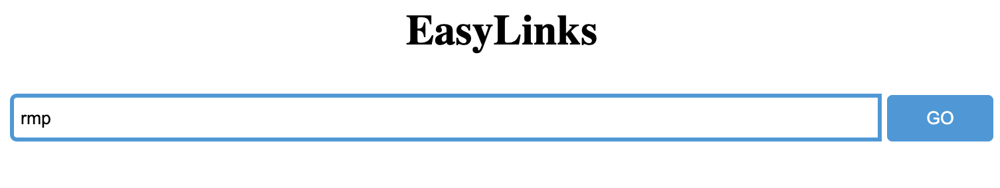

# EasyLinks
EasyLinks is a project that helps people specifially college students to organize their frequently visited websites. People could store their favorite website address as a short, easy-to-remember shortcut. Also, EasyLinks provides the way for college students to quick navigate through their campus and search for other students or faulty member in the same school.

## :one: Using EasyLinks
**To use a link, you can simply type in the link in the search bar or append it at the end of the EasyLinks URL.**

For example, say we want to use the shortcut `rmp` that is mapped to [rate-my-professor](https://www.ratemyprofessors.com/) website:
- Append to the end of the EasyLinks URL, like `https://easylinks-step-2020.uc.r.appspot.com/rmp`

- Type in directly in the search bar.

## :two: Create and Manage Your Own Links
**All links created will be shown and can be managed in the [management page](https://easylinks-step-2020.uc.r.appspot.com/manage.html).**

You can create and use two types of links:
| Type | Description |
| - | - |
| Public links | Created by one person but can be viewed and used by all people using EasyLinks.|
| Private links| Created by one person and can be only be viewed and used by that person.       |

**Note:**
  1. To use private links, you may need to login with your email first.
  2. `~next`, `~who`, `~next` are reserved shortcuts for other functionalities. You may not create or change links starting from those. For more information, [see below](https://github.com/jiaxi312/hello-word/blob/master/README.md#three-calender-next).

## :three: Calender: `~next`
`~next` will show the next event from your Google calender. 

EasyLinks will help you to navigate to the meeting place and give you an latest time to leave for that place.

Also, as most people are WFH, EasyLinks would display the Hangout link for that meeting if there is any.

### Usage: ###

Type `~next` directly in the search bar.

*OR* 

Append `~next` to the EasyLinks URL, like `https://easylinks-step-2020.uc.r.appspot.com/~next`.

### Note: ###
You may need to log in and authorize EasyLink to view your Google Calender.

## :four: People Search: `~who` ###
`~who` will assist you search people in your school and email them.

All matching people with their email address will be displayed, and you would have the option to email them.

To use it, simply add the name you want to search to the shortcut. See example below.

### Usage: ### 
**The example below shows how to search people called Alice.**

Type `~who/Alice` in the search bar.

*OR*

Append `~who/Alice` to the EasyLinks URL, like `https://easylinks-step-2020.uc.r.appspot.com/~who/Alice`.

### Note: ###
For now, People Search is only avaliable for students at [Columbia University](https://www.columbia.edu/). More is about to coming.

## :five: Navigation: `~where` ##
`~where` shortcut will search a place you type in.

If you are a college student, you can use place abbrevation in your school for searching!

To use it, simply add the destination name or abbrevation you want to search to the shortcut. See example below.

### Usage: ###
**The example below shows how to search the place with abbrevated name WAT (stands for Watson Hall).**

Type `~where/wat` in the search bar.

*OR*

Append `~where/wat` to the EasyLinks URL, like `https://easylinks-step-2020.uc.r.appspot.com/~where/wat`.

### Note: ###
For now, abbrevation search will only support building in [Columbia University](https://www.columbia.edu/). More will be added. 
