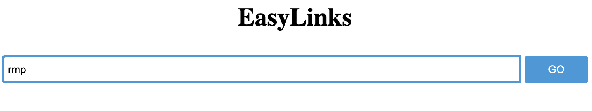

# EasyLinks
EasyLinks is a project that helps people specifially college students to organize their frequently visited websites. People could store their favorite website address as a short, easy-to-remember shortcut. Also, EasyLinks provides the way for college students to quick navigate through their campus and search for other students or faulty member in the same school.

## :one: Create and Manage Your Own Links
You can create and use two types of links:
- Public links: Created by one person but can be viewedn and used by all users using EasyLinks.
- Private links: Created by one person and can be only be viewed and used by that person.

**All links created will be shown and can be managed in the [management page](https://easylinks-step-2020.uc.r.appspot.com/manage.html).**

## :two: Using EasyLinks
You can use the exsiting public link or the private links you created.

**To use a link, you can simply type in the link in the search bar or append it at the end of the EasyLinks URL.**

For example, say we want to use the shortcut `rmp` that is mapped to [rate-my-professor](https://www.ratemyprofessors.com/) website:
- Option One: Type in directly in the search bar.

- Option Two: Append to the end of the EasyLinks URL. 
  - `https://easylinks-step-2020.uc.r.appspot.com/rmp`
